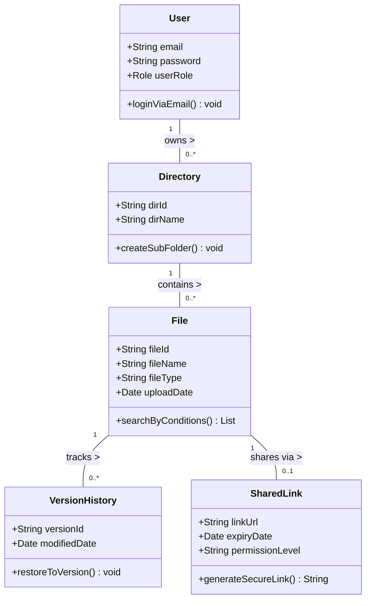

# [Mini Drive] 요구사항 분석서

## 1. 서론

### 1.1 목적 및 범위
본 시스템은 여러 팀이 동시에 협업하는 프로젝트 환경에서 파일의 최신 버전 관리 어려움과 분산된 저장 경로로 인한 검색 시간 낭비 문제를 해결하기 위해 설계된 중앙 집중형 클라우드 파일 관리 시스템이다. 사용자들은 웹 브라우저를 통해 별도의 설치 없이 문서, 이미지, 영상 등 다양한 업무 파일을 업로드하고 안전하게 보관할 수 있다. 또한, 권한 설정을 통한 팀 내 공유 및 외부 협력 업체와의 보안 링크 공유 기능을 통해 원활한 협업 피드백 루프를 제공하여 조직 전체의 프로젝트 협업 생산성을 높이는 것을 목적으로 한다.

### 1.2 용어 정의
| 용어 | 설명 |
| :--- | :--- |
| **Mini Drive** | 본 프로젝트에서 개발하는 클라우드 기반 파일 공유 시스템의 명칭 |
| **RBAC (Role-Based Access Control)** | 사용자 역할에 따라 데이터에 대한 접근 권한을 제한하는 시스템 통제 방식 |
| **버전 관리 (Version Control)** | 파일이 수정될 때마다 이전 버전을 저장하여 이력을 관리하고 특정 시점으로 복구할 수 있는 기능 |
| **세분화된 권한** | 파일 공유 시 부여하는 조회, 수정, 댓글 등의 구체적인 권한 수준 |

### 1.3 참조 문서
* [프로젝트 정의서](doc/project_definition.md)
* [프로젝트 관리 계획서](doc/Project_Management_Plan.md)
* [대상 시스템 품질 요소 측정](doc/quality_factors.md)

---

## 2. 시스템 개요 (기능 관점)

### 2.1 소프트웨어 컨텍스트 (Context)

#### 2.1.1 Actor Table
| Actor | Role |
| :--- | :--- |
| **사용자 (User)** | 시스템에 가입하여 파일을 업로드/다운로드하고, 버전 복구 및 다중 조건 검색, 공유 기능을 이용하는 주체 |
| **관리자 (Admin)** | 조직의 중요 데이터를 보호하기 위해 시스템 접근 권한(RBAC), 계정 및 저장 공간을 효율적으로 통제하는 주체 |
| **시스템 (System)** | 파일의 수정 버전을 관리하고, 조건에 맞는 검색 결과를 반환하며 암호화된 공유 링크를 생성해 주는 주체 |

#### 2.1.2 UseCase Diagram

### 2.2 기능 분류 및 설명 (UseCase Description)

#### UC_01: 파일 및 폴더 관리
| 항목 | 내용 |
| :--- | :--- |
| **Use Case Name** | 파일 및 다단계 폴더를 관리한다. |
| **ID** | U_01 |
| **Importance Level** | High |
| **Primary Actor** | 사용자 |
| **Brief Description** | 다양한 종류의 파일을 업로드/다운로드하고, 다단계 폴더 구조를 통해 체계적으로 조직화한다. |
| **Normal Flow** | 1. 사용자는 파일을 추가할 폴더를 선택한다. 2. 파일을 업로드하거나 기존 폴더의 구조를 변경한다. 3. 시스템은 변경된 폴더 구조와 파일을 데이터베이스에 저장한다. |

#### UC_02: 세분화된 파일 공유 및 권한 제어
| 항목 | 내용 |
| :--- | :--- |
| **Use Case Name** | 파일 공유 및 권한을 제어한다. |
| **ID** | U_02 |
| **Importance Level** | High |
| **Primary Actor** | 사용자 |
| **Brief Description** | 파일에 대해 사용자별 조회, 수정, 댓글 권한을 설정하고 만료 기간이 포함된 외부 공유 링크를 생성한다. |
| **Normal Flow** | 1. 공유할 파일을 선택하고 권한 수준(조회/수정/댓글) 및 만료 기간을 설정한다. 2. 시스템은 조건이 적용된 외부 링크를 생성한다. 3. 사용자는 생성된 링크를 협력 업체나 팀원에게 전달한다. |

#### UC_03: 파일 버전 관리 및 복구
| 항목 | 내용 |
| :--- | :--- |
| **Use Case Name** | 파일의 이전 버전을 복구한다. |
| **ID** | U_03 |
| **Importance Level** | High |
| **Primary Actor** | 사용자 |
| **Brief Description** | 파일 수정 시 자동으로 보관된 이전 버전 리스트를 확인하고 특정 시점으로 복원한다. |
| **Normal Flow** | 1. 사용자가 특정 파일의 '버전 기록'을 요청한다. 2. 시스템은 최대 1달 간의 변경 이력 목록을 제공한다. 3. 사용자가 원하는 시점을 선택하면 파일이 해당 상태로 롤백된다. |

---

## 3. 요구사항 명세 (구조 및 행위 관점)

### 3.1 정적 분석 (구조 관점)

#### 3.1.1 클래스 다이어그램

---

## 4. 인터페이스 분석

* **사용자 인터페이스 (UI):** 특별한 프로그램 설치 없이 웹 브라우저를 통해 직관적이고 간단하게 사용할 수 있는 파일 탐색기 형태의 대시보드를 제공한다. 다중 조건(파일명, 날짜, 업로더, 유형) 필터를 UI에 제공하여 고속 검색을 지원한다.
* **소프트웨어 인터페이스:** 이메일 기반 인증 API 및 파일 암호화 모듈과 연동된다.

## 5. 제약사항 및 품질 요구사항

* **보안 우선 원칙 (Security over Usability):** 조직의 내부 문서가 오가는 시스템이므로, 사용성이 다소 저하되더라도 데이터 전송 암호화 및 철저한 접근 권한 관리(RBAC) 등 보안을 최우선으로 설계해야 한다.
* **성능 및 효율성 (Performance & Efficiency):** 약 200명 규모의 직원이 동시에 시스템을 사용하더라도 병목 현상 없이 안정적으로 서버 리소스가 관리되어야 한다.
* **저장 공간 보전 정책 (Reliability & Efficiency):** 신뢰성과 서버 자원 한계의 균형을 위해, 파일 복구용 데이터는 최근 1달 간의 변경 이력만 저장하는 보전 정책을 수립한다.
* **확장성 (Extensibility):** 향후 문서 공동 편집, 자동 파일 분류, AI 기반 검색 기능 등이 추가될 수 있으므로 새로운 모듈을 쉽게 통합할 수 있는 유연한 아키텍처로 설계되어야 한다.
* **테스트 용이성 (Testability):** 파일 저장, 폴더 구성, 검색, 권한 제어 등의 기능은 독립적으로 구현되어 단위 및 통합 테스트가 원활해야 한다.

## 6. 요구사항 추적표

| 요구사항 ID | 요구사항 명칭 | U_01 (관리) | U_02 (공유) | U_03 (복구) | 비고 |
| :--- | :--- | :---: | :---: | :---: | :--- |
| **FR_001** | 다단계 폴더 구조를 생성하고 파일을 관리할 수 있다. | O | | | |
| **FR_002** | 파일명, 날짜, 업로더, 파일 유형 등 다중 조건으로 파일을 검색할 수 있다. | O | | | |
| **FR_003** | 세분화된 권한 및 만료 기간이 포함된 공유 링크를 생성할 수 있다. | | O | | |
| **FR_004** | 파일의 이전 버전을 확인하고 복구할 수 있다. | | | O | |
| **NFR_001** | 200명 동시 접속 시에도 병목 현상이 없어야 한다. | O | O | O | 효율성 |
| **NFR_002** | 데이터 전송은 암호화되고 RBAC 기반으로 통제되어야 한다. | O | O | O | 보안성 |
| **NFR_003** | 서버 자원 절약을 위해 변경 이력은 최근 1달간만 보관한다. | | | O | 신뢰성 |

---
## 7. 참고문헌 및 부록
* 해당없음