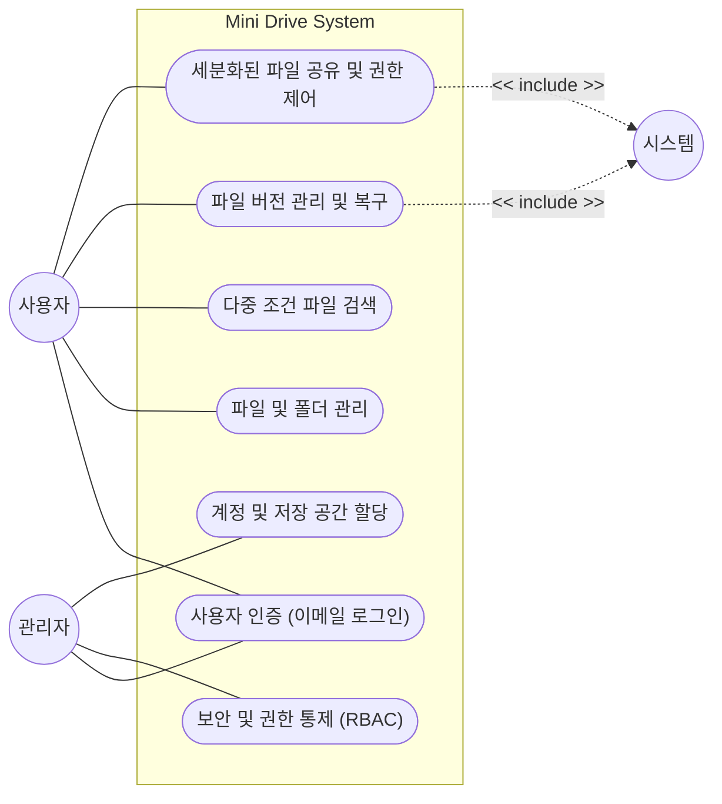
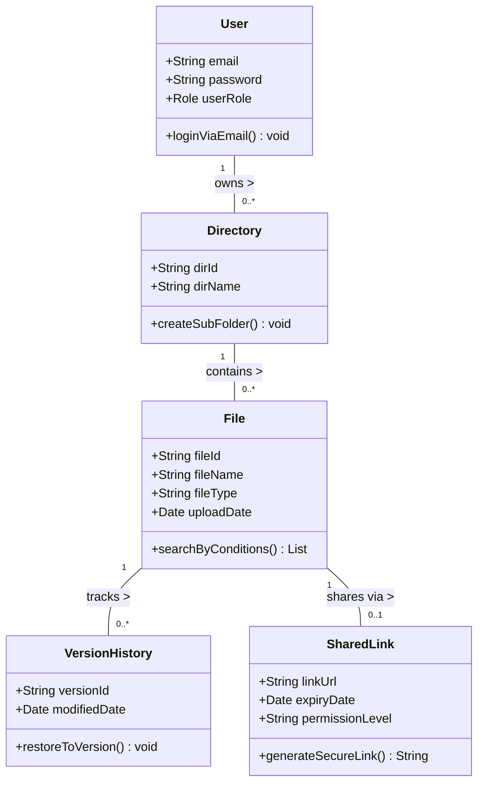
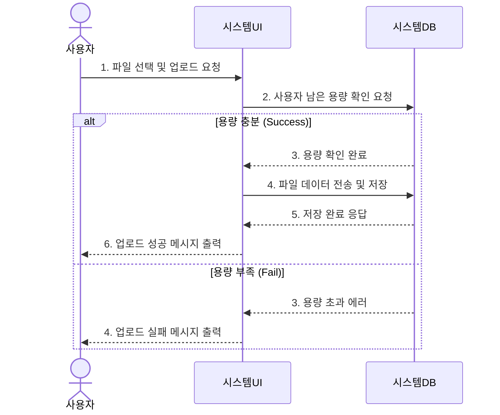
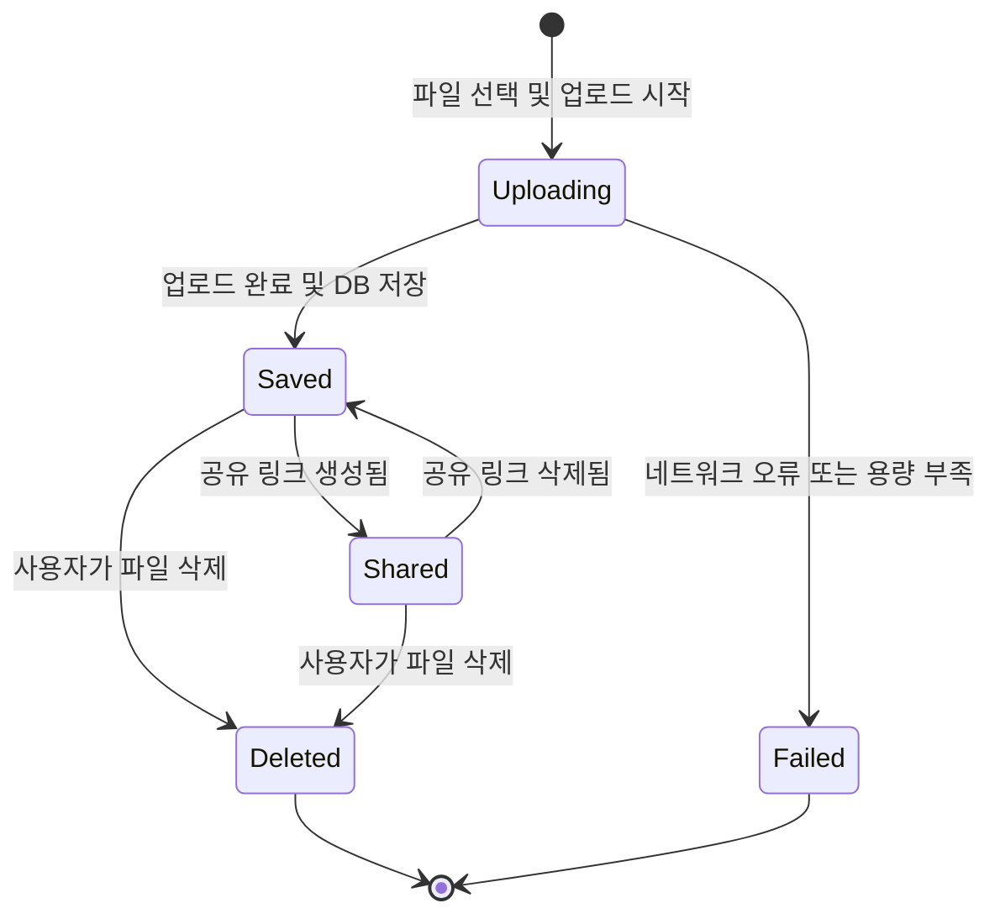

# [Mini Drive] 요구사항 분석서

## 1. 서론

### 1.1 목적 및 범위
본 시스템은 여러 팀이 동시에 협업하는 프로젝트 환경에서 파일의 최신 버전 관리 어려움과 분산된 저장 경로로 인한 검색 시간 낭비 문제를 해결하기 위해 설계된 중앙 집중형 클라우드 파일 관리 시스템이다. 사용자들은 웹 브라우저를 통해 별도의 설치 없이 문서, 이미지, 영상 등 다양한 업무 파일을 업로드하고 안전하게 보관할 수 있다. 또한, 권한 설정을 통한 팀 내 공유 및 외부 협력 업체와의 보안 링크 공유 기능을 통해 원활한 협업 피드백 루프를 제공하여 조직 전체의 프로젝트 협업 생산성을 높이는 것을 목적으로 한다.

### 1.2 용어 정의
| 용어 | 설명 |
| :--- | :--- |
| **Mini Drive** | 본 프로젝트에서 개발하는 클라우드 기반 파일 공유 시스템의 명칭 |
| **RBAC (Role-Based Access Control)** | 사용자 역할에 따라 데이터에 대한 접근 권한을 제한하는 시스템 통제 방식 |
| **버전 관리 (Version Control)** | 파일이 수정될 때마다 이전 버전을 저장하여 이력을 관리하고 특정 시점으로 복구할 수 있는 기능 |
| **세분화된 권한** | 파일 공유 시 부여하는 조회, 수정, 댓글 등의 구체적인 권한 수준 |

### 1.3 참조 문서
* [프로젝트 정의서 (시스템 정의서)](doc/project_definition.md)
* [프로젝트 관리 계획서](doc/Project_Management_Plan.md)
* [대상 시스템 품질 요소 측정](doc/quality_factors.md)

---

## 2. 시스템 개요 (기능 관점)

### 2.1 소프트웨어 컨텍스트 (Context)

#### 2.1.1 Actor Table
| Actor | Role |
| :--- | :--- |
| **사용자 (User)** | 시스템에 가입하여 파일을 업로드/다운로드하고, 버전 복구 및 다중 조건 검색, 공유 기능을 이용하는 주체 |
| **관리자 (Admin)** | 조직의 중요 데이터를 보호하기 위해 시스템 접근 권한(RBAC), 계정 및 저장 공간을 효율적으로 통제하는 주체 |
| **시스템 (System)** | 파일의 수정 버전을 관리하고, 조건에 맞는 검색 결과를 반환하며 암호화된 공유 링크를 생성해 주는 주체 |

#### 2.1.2 UseCase Diagram

### 2.2 기능 분류 및 설명 (UseCase Description)

#### UC_01: 파일 및 폴더 관리
#### UC_01: 파일 및 폴더 관리
| 항목 | 내용 |
| :--- | :--- |
| **Use Case Name** | 파일 및 다단계 폴더를 관리한다. |
| **ID** | U_01 |
| **Importance Level** | High |
| **Primary Actor** | 사용자 |
| **Use Case Type** | Detail, essential |
| **Brief Description** | 사용자가 다양한 종류의 업무 파일을 클라우드 서버에 업로드/다운로드하고 폴더 구조로 체계화한다. |
| **Stakeholders and Interests** | **사용자**: 업무 파일을 유실 없이 보관하고 다단계 구조로 손쉽게 분류하길 원한다. **관리자**: 직원별 무분별한 파일 업로드로 인한 스토리지 총량 오버플로우를 감시하고자 한다. |
| **Trigger** | 사용자가 화면 내에서 '파일 업로드', '다운로드' 또는 '새 폴더 생성' 버튼을 클릭한다. |
| **Relationships** | **Association**: 사용자 **Include**: 없음 **Extend**: 없음 **Generalization**: 없음 |
| **Normal Flow of Events** | 1. 사용자는 파일을 관리하거나 추가할 폴더 경로를 선택한다. 2. 사용자는 로컬 시스템에서 파일을 선택한 후 '업로드' 버튼을 누른다. 3. 시스템은 사용자의 남은 저장 용량 정책을 체크한다. 4. 시스템은 파일을 클라우드 스토리지에 격리 저장하고 구조화된 디렉터리 목록을 실시간으로 갱신한다. |
| **Alternative / Exceptional Flows** | **3.a1**: 남은 저장 용량이 부족할 경우, 시스템은 대시보드에 '용량 부족' 경고 메시지를 출력하고 업로드를 취소한다. **3.a2**: 업로드 대상 파일이 단일 최대 크기(1GB) 제약 조건을 초과하는 경우 에러 메시지를 출력한다. |

#### UC_02: 세분화된 파일 공유 및 권한 제어
| 항목 | 내용 |
| :--- | :--- |
| **Use Case Name** | 파일 공유 및 권한을 제어한다. |
| **ID** | U_02 |
| **Importance Level** | High |
| **Primary Actor** | 사용자 |
| **Use Case Type** | Detail, essential |
| **Brief Description** | 파일에 대해 사용자별 조회, 수정, 댓글 권한을 세분화하여 할당하고 암호화된 고유 외부 공유 링크를 발급한다. |
| **Stakeholders and Interests** | **사용자**: 협력 업체나 팀원에게 명확한 권한만 제어하여 안전한 공유 피드백을 형성하길 원한다. **관리자**: 중요 조직 자산이 승인되지 않은 외부 영역으로 악의적으로 복사 및 노출되는 것을 차단하길 원한다. |
| **Trigger** | 사용자가 파일이나 폴더의 컨텍스트 메뉴에서 '공유 설정' 버튼을 누른다. |
| **Relationships** | **Association**: 사용자 **Include**: 링크 고유 URL 생성 (UC7) **Extend**: 없음 **Generalization**: 없음 |
| **Normal Flow of Events** | 1. 사용자는 공유하려는 파일을 선택하고 상세 권한 범위(조회/수정/댓글)를 명시한다. 2. 외부 반출의 안전성을 위해 링크 접근의 유효 만료 기간을 추가로 입력한다. 3. 시스템은 해당 옵션을 가공하여 암호화 토큰 기반의 고유 URL 공유 링크를 연동 생성한다. 4. 시스템은 정상 발급 메시지와 함께 사용자가 복사할 수 있도록 클립보드에 링크 주소를 대기시킨다. |
| **Alternative / Exceptional Flows** | **1.a1**: 권한 지정 대상 사용자가 사내 DB에 존재하지 않는 잘못된 식별자일 경우, 경고창을 띄우고 지정을 무효화한다. **3.a1**: 공유 보안 정책 필터상 비정상 패턴 유출로 의심될 경우 링크 발급을 즉시 거절하고 차단 로그에 등록한다. |

#### UC_03: 파일 버전 관리 및 복구
| 항목 | 내용 |
| :--- | :--- |
| **Use Case Name** | 파일의 이전 버전을 복구한다. |
| **ID** | U_03 |
| **Importance Level** | High |
| **Primary Actor** | 사용자 |
| **Use Case Type** | Detail, essential |
| **Brief Description** | 파일 수정 시 백업된 스냅샷 이력을 탐색하여 사용자가 지정한 특정 시점의 온전한 데이터 상태로 복원한다. |
| **Stakeholders and Interests** | **사용자**: 협업 도중 잘못 수정한 소스나 덮어쓰기로 깨진 문서 데이터를 과거 이력으로부터 복구해 안정성을 보장받길 원한다. |
| **Trigger** | 사용자가 특정 업무 파일의 '히스토리 / 버전 기록' 항목을 조회 요청한다. |
| **Relationships** | **Association**: 사용자 **Include**: 파일 상태 저장 (UC6) **Extend**: 없음 **Generalization**: 없음 |
| **Normal Flow of Events** | 1. 사용자가 해당 자산의 과거 리비전 상태의 조회를 요청한다. 2. 시스템은 서버 백업 스토리지 엔진에 접근하여 축적된 버전 히스토리 목록을 호출한다. 3. 사용자는 날짜와 변경 유저가 표시된 목록 중 롤백 타깃 시점을 선택하고 '복구' 버튼을 누른다. 4. 시스템은 파일 구조를 타깃 버전으로 안전하게 복원 시키고 변경 성공을 화면에 알린다. |
| **Alternative / Exceptional Flows** | **2.a1**: 저장공간 효율성 유지보수 정책에 따라 해당 파일의 수정 이력이 최근 1달 보전 기한을 초과하여 파기된 경우 리스트에 표기하지 않거나 '조회 불가' 정보를 안내한다. |
---

## 3. 요구사항 명세

### 3.1 정적 분석

### 3.2 CRC 카드
| Class Name | User (사용자) | ID: 01 |
| :--- | :--- | :--- |
| **Description** | 시스템을 이용하는 사용자의 정보를 나타낸다. | **Type:** Concrete, Domain |
| **Responsibilities** | - 파일 업로드/다운로드 요청 - 공유 링크 생성 요청 | **Collaborators** | File, SharedLink |
| **Attributes** | email: String password: String userRole: Role | |

| Class Name | File (파일) | ID: 02 |
| :--- | :--- | :--- |
| **Description** | 시스템에 저장된 파일의 메타데이터와 상태를 나타낸다. | **Type:** Concrete, Domain |
| **Responsibilities** | - 파일 정보(크기, 경로) 제공 - 파일 삭제 및 검색 지원 | **Collaborators** | User, Directory |
| **Attributes** | fileId: String fileName: String fileType: String uploadDate: Date | |

### 3.3 동적 분석

### 3.4 상태 관점 (상태기계 다이어그램)

---

## 4. 인터페이스 분석

* **사용자 인터페이스 (UI):** 특별한 프로그램 설치 없이 웹 브라우저를 통해 직관적이고 간단하게 사용할 수 있는 파일 탐색기 형태의 대시보드를 제공한다. 다중 조건(파일명, 날짜, 업로더, 유형) 필터를 UI에 제공하여 고속 검색을 지원한다.
* **소프트웨어 인터페이스:** 이메일 기반 인증 API 및 파일 암호화 모듈과 연동된다.

## 5. 제약사항 및 품질 요구사항

* **보안 우선 원칙 (Security over Usability):** 조직의 내부 문서가 오가는 시스템이므로, 사용성이 다소 저하되더라도 데이터 전송 암호화 및 철저한 접근 권한 관리(RBAC) 등 보안을 최우선으로 설계해야 한다.
* **성능 및 효율성 (Performance & Efficiency):** 약 200명 규모의 직원이 동시에 시스템을 사용하더라도 병목 현상 없이 안정적으로 서버 리소스가 관리되어야 한다.
* **저장 공간 보전 정책 (Reliability & Efficiency):** 신뢰성과 서버 자원 한계의 균형을 위해, 파일 복구용 데이터는 최근 1달 간의 변경 이력만 저장하는 보전 정책을 수립한다.
* **확장성 (Extensibility):** 향후 문서 공동 편집, 자동 파일 분류, AI 기반 검색 기능 등이 추가될 수 있으므로 새로운 모듈을 쉽게 통합할 수 있는 유연한 아키텍처로 설계되어야 한다.
* **테스트 용이성 (Testability):** 파일 저장, 폴더 구성, 검색, 권한 제어 등의 기능은 독립적으로 구현되어 단위 및 통합 테스트가 원활해야 한다.

## 6. 요구사항 추적표

| 요구사항 ID | 요구사항 명칭 | U_01 (관리) | U_02 (공유) | U_03 (복구) | 비고 |
| :--- | :--- | :---: | :---: | :---: | :--- |
| **FR_001** | 다단계 폴더 구조를 생성하고 파일을 관리할 수 있다. | O | | | |
| **FR_002** | 파일명, 날짜, 업로더, 파일 유형 등 다중 조건으로 파일을 검색할 수 있다. | O | | | |
| **FR_003** | 세분화된 권한 및 만료 기간이 포함된 공유 링크를 생성할 수 있다. | | O | | |
| **FR_004** | 파일의 이전 버전을 확인하고 복구할 수 있다. | | | O | |
| **NFR_001** | 200명 동시 접속 시에도 병목 현상이 없어야 한다. | O | O | O | 효율성 |
| **NFR_002** | 데이터 전송은 암호화되고 RBAC 기반으로 통제되어야 한다. | O | O | O | 보안성 |
| **NFR_003** | 서버 자원 절약을 위해 변경 이력은 최근 1달간만 보관한다. | | | O | 신뢰성 |

---
## 7. 참고문헌 및 부록
* 해당없음